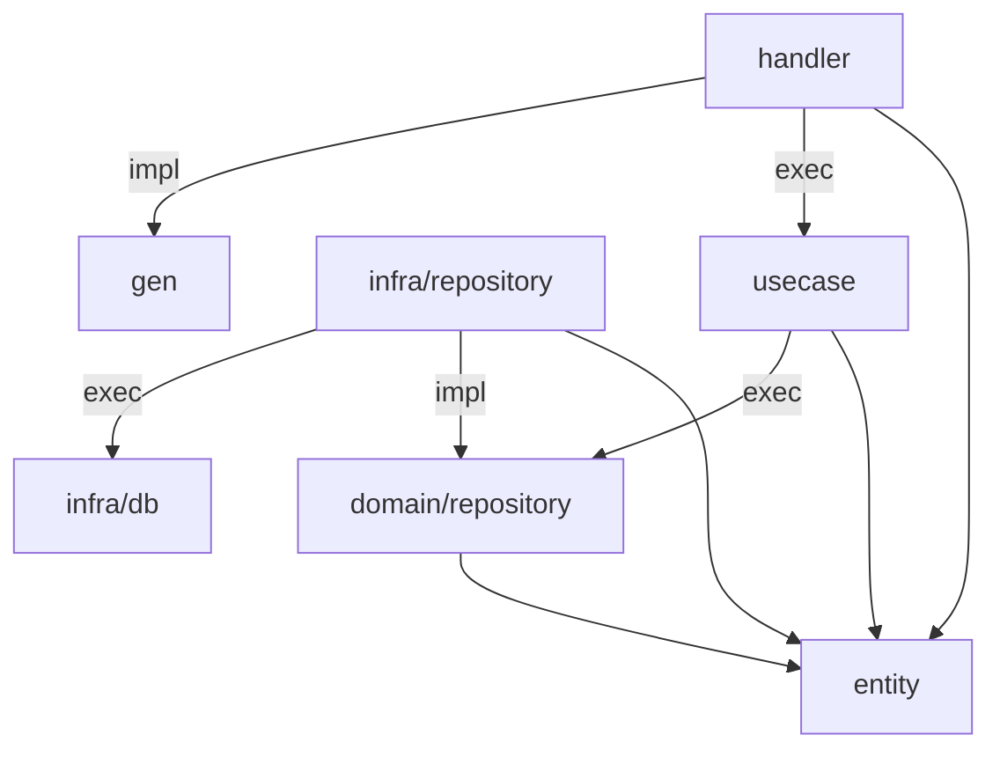

## directory structure

```
|--cmd  // entrypoint per command.
|  |    // depends: all
|  |--s-progress
|  |  |--main.go
|
|--domain   // domain: basic abstract data schema and method interface. that should not changed in future.
|  |--entity    // entities: define data structs.
|  |  |--user.go
|  |--repository    // domain/repository: define method interface of repository (datastore) operation.
|  |  |             // impl is in infra/repository. 
|  |  |             // depends: entity
|  |  |--users
|  |  |  |--v1
|  |  |  |  |--repository.go
|
|--handler  // handler: define instances that will passed to connect handler.
|  |        // this method must satisfy connect interface (constructor returns connect i/f).
|  |        // however, method may just call interactor method and convert its input/output data structure.
|  |        // the interactor method is invoked from member of receiver(like "self", or "this").
|  |        // depends: entity(inherited from usecase), gen, usecase(a.k.a. interactor)
|  |--users
|  |  |--v1
|  |  |  |--server.go
|
|--infra    // infra: impl of infrastructure like db.
|  |--db    // db: db schema and operation method. auto generated by sqlc.
|  |  |--users
|  |  |  |--v1
|  |  |  |  |--db.go
|  |  |  |  |--models.go
|  |  |  |  |--query.sql.go
|  |--repository    // infra/repository: impl of domain/repository.
|  |  |             // may call db method.
|  |  |             // depends: entity(inherited from domain/repository), domain/repository, infra/db
|  |  |--users
|  |  |  |--v1
|  |  |  |  |--repository.go
|
|--log  // log: just a log tools.
|  |    // may depended by any modules.
|  |--slog.go
|
|--usecase  // handler: define instances that will passed to server handler (handler instance).
|  |        // the method may just call domain/repository method and convert its input/output data structure.
|  |        // the domain/repository method is invoked from member of receiver(like "self", or "this").
|  |        // depends: entity, domain/repository
|  |--users
|  |  |--v1
|  |  |  |--interactor.go
|
|--proto
|  |--gen   // gen: defined protobuf methods and data structs. auto generated by buf.
|  |  |     // there are data struct of response, request, and some methods like getters.
|  |  |     // additionally, ***.connect.go provides service(api method) interface and handler constructor.
|  |  |--users
|  |  |  |--v1
|  |  |  |  |--users.pb.go
|  |  |  |  |--usersv1protoconnect
|  |  |  |  |  |--users.connect.go
|  |  |--***
|  |  |  |--v1
|  |  |  |  |--***.pb.go
|  |  |  |  |--***v1protoconnect
|  |  |  |  |  |--***.connect.go
|  |
|  |    // below are the proto definition per service (api groups).
|  |--users
|  |  |--v1
|  |  |  |--users.proto
|  |--***
|  |  |--v1
|  |  |  |--***.proto
```

## dependency graph



...is this proper depends???:thinking_face:

## main DI

main creates instances (DI).

when creating A instance and if A depends B, pass B into A constructor arg.

example:

```go
dbConnection, err := pgx.Connect(dbCtx, "")
// infra/repo depends db
usersRepository := infrarepo.New(dbConnection)
// usecase depends infra/repo(impl of domain/repo)
usersInteractor := usecase.New(usersRepository)
// handler depends usecase
usersServer := handler.New(logger, usersInteractor)

// gen depends usecase
usersServiceHandler := gen.New(usersServer)
// http depends gen
mux := http.New(usersServiceHandler)

// exec
listen(mux, ...)
```
